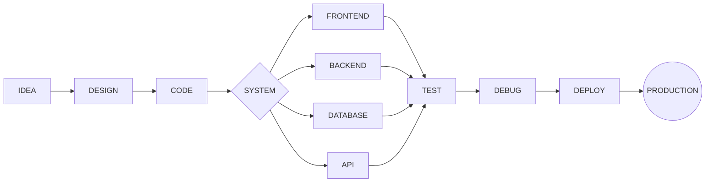

<div align="center">

# `KZM://START`

### `FULL STACK DEVELOPER // SYSTEMS INFORMATION // BUILDING IN PROGRESS`


<br><br>

```text id="w9p0v7"
┌─────────────────────────────────────────────────────────────┐
│ KZM NETWORK :: DEVELOPER NODE                               │
├─────────────────────────────────────────────────────────────┤
│ USER      Kauan Carvalho dos Santos                         │
│ ROLE      Full Stack Developer                              │
│ DEGREE    Sistemas de Informação                            │
│ REGION    Mato Grosso // Brazil                             │
│ STATUS    ● ONLINE                                          │
│ UPTIME    Learning continuously...                          │
└─────────────────────────────────────────────────────────────┘
```

</div>

---

# `01 // SYSTEM OVERVIEW`

<div align="center">


</div>

---

# `02 // REPOSITORY MATRIX`

<div align="center">


</div>

<br>

```text id="gl3mqs"
 REPOSITORY ANALYSIS
 ──────────────────────────────────────────────

 repositories   → scanning...
 languages      → analyzing...
 commits        → indexing...
 projects       → synchronized

 > telemetry stream active
```

---

# `03 // ACTIVITY SIGNAL`

<div align="center">


</div>

---

# `04 // CONTRIBUTION CITY`

<div align="center">

### `3D CONTRIBUTION MATRIX`


</div>

```text id="kuad4r"
              ▲ commits
             ╱│╲
            ╱ │ ╲
           ╱  │  ╲
     code ─── NODE ─── projects
           ╲  │  ╱
            ╲ │ ╱
             ╲│╱
              ▼
           activity
```

---

# `05 // ACTIVE PROJECT NODES`

<div align="center">

<a href="https://github.com/Kzim-Start/Projeto-Chat">

</a>

<a href="https://github.com/Kzim-Start/portifolio">

</a>

<a href="https://github.com/Kzim-Start/Start">

</a>

</div>

---

# `06 // DEVELOPER TELEMETRY`

<div align="center">


</div>

<br>

<div align="center">


</div>

---

# `07 // TECHNOLOGY MODULES`

<div align="center">

### `CORE`


<br><br>

### `DATA`


<br><br>

### `DEVELOPMENT ENVIRONMENT`


</div>

---

# `08 // DEVELOPMENT CORE`

```javascript id="8j9jba"
class Kauan {

    constructor() {
        this.role = "Full Stack Developer";
        this.degree = "Sistemas de Informação";

        this.interests = [
            "Software Engineering",
            "Backend Development",
            "Artificial Intelligence",
            "Automation",
            "Game Development"
        ];

        this.status = "ONLINE";
    }

    build(idea) {
        return idea
            .design()
            .code()
            .debug()
            .improve()
            .deploy();
    }
}

const developer = new Kauan();

while (developer.status === "ONLINE") {
    developer.learn();
    developer.build();
}
```

---

# `09 // EXECUTION PIPELINE`



---

# `10 // CONTRIBUTION STREAM`

<div align="center">

<picture>

<source
media="(prefers-color-scheme: dark)"
srcset="https://raw.githubusercontent.com/Kzim-Start/Kzim-Start/output/github-contribution-grid-snake-dark.svg"
/>

<source
media="(prefers-color-scheme: light)"
srcset="https://raw.githubusercontent.com/Kzim-Start/Kzim-Start/output/github-contribution-grid-snake.svg"
/>


</picture>

</div>

---

# `11 // NETWORK INTERFACE`

<div align="center">

```text id="4s74go"
╭──────────────────────────────────────────────╮
│                                              │
│          CONNECTION AVAILABLE                │
│                                              │
│      linkedin :: gmail :: github             │
│                                              │
╰──────────────────────────────────────────────╯
```

<br>

[](https://www.linkedin.com/in/kauan-c/)

[](mailto:kcarvalhodossanto@gmail.com)

[](https://github.com/Kzim-Start)

<br><br>

### `SYSTEM STATUS`

`● ONLINE`

`BUILDING // LEARNING // SHIPPING`

<br>

```text id="pignxt"
KZM://START
────────────────────────────
SYSTEM READY.
AWAITING NEXT PROJECT...
```

</div>
